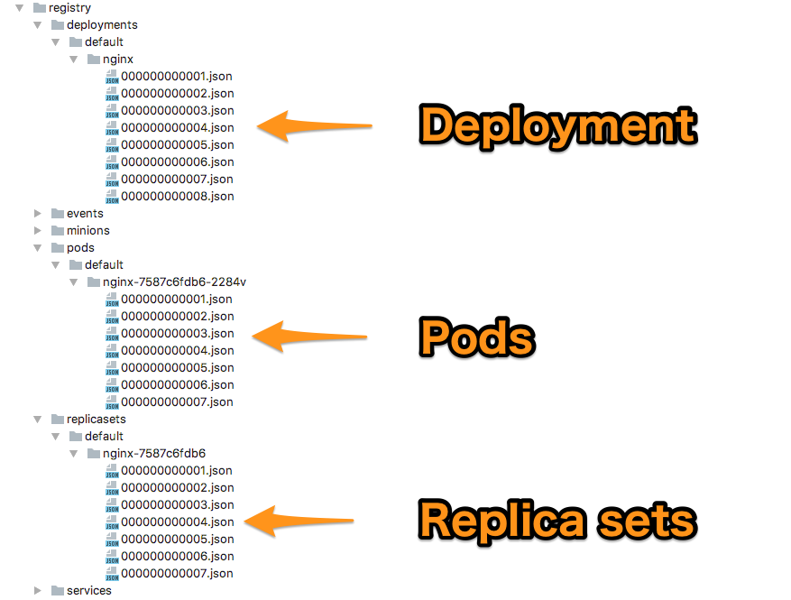

# kube-etcd-helper

[](https://goreportcard.com/report/github.com/yamamoto-febc/kube-etcd-helper)
[](https://travis-ci.org/yamamoto-febc/kube-etcd-helper)

`kube-etcd-helper` is a helper command for tracking etcd in kubernetes.

## Install

Download latest `kube-etcd-helper` binary from [releases](https://github.com/yamamoto-febc/kube-etcd-helper/releases/latest).   
And grant execute permission to `kube-etcd-helper` like as `chmod +x kube-etcd-helper`.  

If you have golang develop environments, you can install using `go get`.

```bash
$ go get github.com/yamamoto-febc/kube-etcd-helper
```

## Usage

You need to be able to communicate with the etcd endpoint.  
For example, in the case of `docker-for-mac`, make it accessible to the endpoint as follows:

```bash
$ kubectl port-forward etcd-docker-for-desktop 2379:2379 --namespace=kube-system
```

### List keys

```bash
$ kube-etcd-helper list 
```
    
### Get value

```bash
$ kube-etcd-helper get /registry/namespaces/default
    
# pretty format
$ kube-etcd-helper get --pretty /registry/namespaces/default
```

    
### Dump values

```bash
$ kube-etcd-helper dump
    
# pretty format
$ kube-etcd-helper dump --pretty
    
# with prefix
$ kube-etcd-helper dump /registry/namespaces
    
# using excludes option
$ kube-etcd-helper dump -e /registry/services/endpoints/kube-system/kube-scheduler 
```
    
### Watch events

```bash
$ kube-etcd-helper watch
    
# pretty format
$ kube-etcd-helper watch --pretty
    
# with prefix
$ kube-etcd-helper watch /registry/namespaces
    
# using excludes option
$ kube-etcd-helper watch -e /registry/services/endpoints/kube-system/kube-scheduler

# output to directory per keys
$ kube-etcd-helper watch --output-dir out/
```

#### Watch events output example:



## Options

### Configure etcd endpoint

By default, `http://127.0.0.1:2379` is used to endpoint of etcd.  
If you want to change it, please specify `--endpoint` option or `ETCD_ENDPOINT` environment variable.

```bash
# use command-line option
$ kube-etcd-helper --endpoint https://127.0.0.1:4000
    
# use environment variable
$ ETCD_ENDPOINT=https://127.0.0.1:4000 kube-etcd-helper ...
```

### Other options

```console
NAME:
   kube-etcd-helper - for tracking etcd(v3) events in kubernetes

USAGE:
   kube-etcd-helper [global options] command [command options] [arguments...]

VERSION:
   0.0.1

COMMANDS:
     dump      Dump all values
     get       Get value
     list, ls  List all keys
     watch     watch values
     help, h   Shows a list of commands or help for one command

GLOBAL OPTIONS:
   --endpoint value  Etcd endpoint (default: "http://127.0.0.1:2379") [$ETCD_ENDPOINT]
   --key value       Etcd TLS client key [$ETCD_KEY]
   --cert value      Etcd TLS client certificate [$ETCD_CERT]
   --cacert value    Etcd server TLS CA certificate [$ETCD_CA_CERT]
   --help, -h        show help (default: false)
   --version, -v     print the version (default: false)

COPYRIGHT:
   Copyright (C) 2018 Kazumichi Yamamoto.
```

## License

 `kube-etcd-helper` Copyright (C) 2018 Kazumichi Yamamoto.

  This project is published under [Apache 2.0 License](LICENSE.txt).
  
## Author

  * Kazumichi Yamamoto ([@yamamoto-febc](https://github.com/yamamoto-febc))